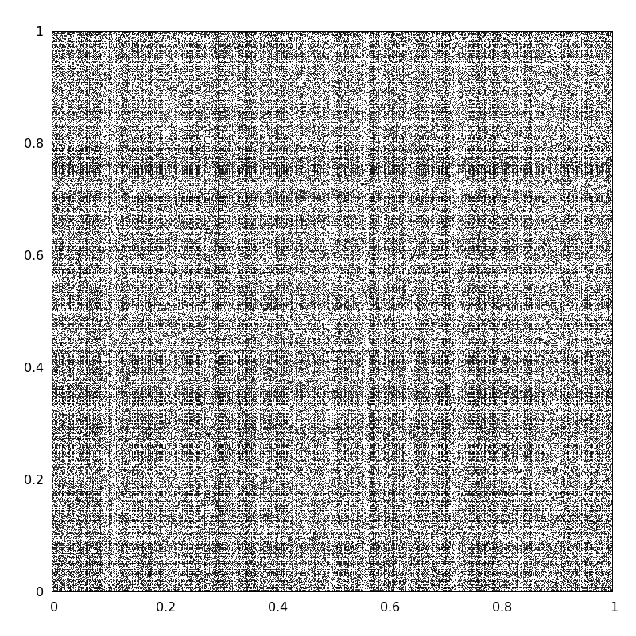
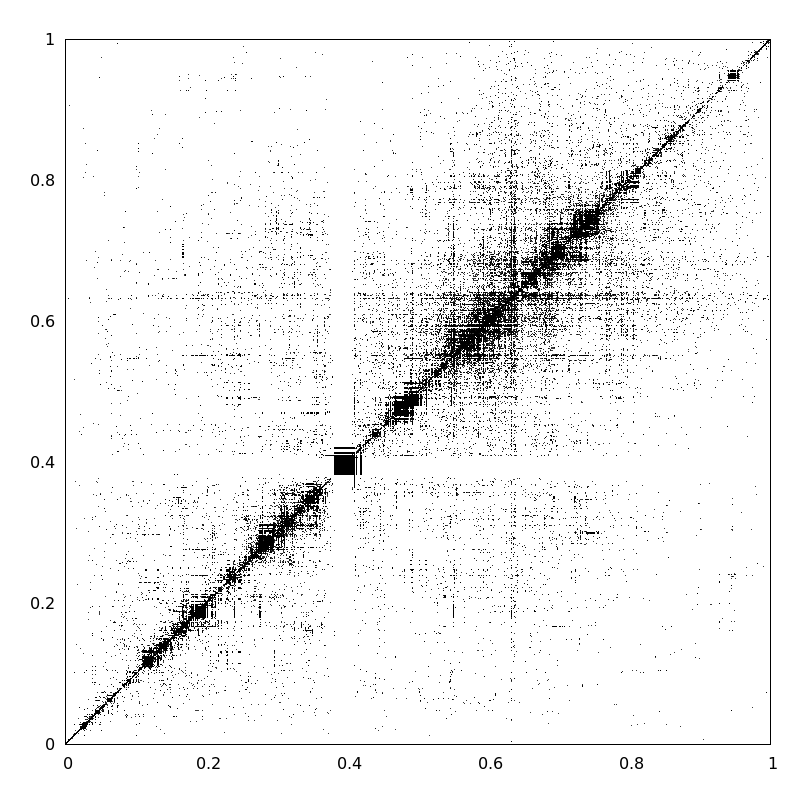

# seriation
This software is an efficient implementation of the [Seriation](http://www.jstatsoft.org/v25/i03) problem which 'finds a suitable linear order for a set of objects'. It has been used to order a network of proteins such that 'related' nodes are closer in the other.

## Authors

The Seriation Package was developed by [Felipe Kuentzer](http://lattes.cnpq.br/1979213773480902), in collaboration with 
Douglas G. Ávila, Alexandre Pereira, Gabriel Perrone, Samoel da Silva, [Alexandre Amory](http://lattes.cnpq.br/2609000874577720), and [Rita de Almeida](http://lattes.cnpq.br/4672766298301524).

**Contact information**: Alexandre Amory (*alexandre.amory at pucrs.br*)

## Inputs

The input file is a textual file describing an undirected network of nodes (in our examples the nodes are protein names). Example:
<pre>
L7007 L7008
L7008 L7007
L7010 L7011
L7011 L7010
L7014 L7015
L7015 L7014
L7017 Z1275
</pre>

In the tab Files you can find networks for different species such as [Escherichia coli](data/Escherichia_coli.dat), [Mus musculus](data/Mus_musculus.dat), [Saccharomyces cerevisiae](data/Saccharomyces_cerevisiae.dat), [Homo sapiens](data/Homo_sapiens.dat), among others.

## Outputs

The output is a text file with the order of the network nodes. Example:

<pre>
Protein	dim1
Z5822	0
Z5823	1
Z2911	2
Z2910	3
Z2909	4
Z4123	5
Z4124	6
Z3105	7
Z3106	8
...
</pre>

The following image represents the Homo sapiens network with a *random ordering*.

The next image represents the Homo sapiens network **'seriated'**.

## Download and Instalation

The Seriation Package is developed in C and tested on Ubuntu 14.04.
* Download the [package](https://github.com/amamory/seriation/releases/latest) .
* Is recommended to update your packages before the instalation:
> sudo apt-get install update
* To install, you can double-click it or execute:
> sudo dpkg -i cfm-seriation_1.0-1_amd64.deb
* In case of missing dependencies, try: 
> sudo apt-get install -f
* To unistall:
> sudo dpkg -r cfm-seriation

* this distribution has the following files

<pre>
/usr/share/cfm-seriation/bin/             Executable file
/usr/share/cfm-seriation/etc/             Auxiliar used to plot charts with GNUPLOT
/usr/share/cfm-seriation/data/            Biological input networks
/usr/share/cfm-seriation/src/             Source code in C
</pre>

## Download and Compilation

> sudo apt-get install git

> git clone https://github.com/amamory/seriation.git

> cd seriation

> gcc cfm-seriation.c -lm -lpthread -lrt -o cfm-seriation

## How to Use

type 'cfm-seriation' to show the options:

<pre>
cfm-seriation

Usage: cfm-seriation [OPTION...]

 Seriation Parameters:
   f=[NETWORK FILE].dat       Network file path name
   o=[ORDER FILE].dat         Apply initial order
   i=[INTERVAL]               Number of isothermal steps
   m=[STEPS]                  Number of steps
   c=[FACTOR]                 Cooling factor
   a=[ALPHA]                  Alpha value
   p=[PERCENTUAL]             Percentual energy for initial temperature
   s=[SEDD]                   Random seed
   P                          Plot graphs
   v                          Generate video
</pre>

type to execute the seriation. This process can take about 12 minutes, depending on the CPU.

> ./cfm-seriation f=data/Homo_sapiens.dat m=3000 P

In case you want a video of the process, type to execute the seriation. 

> ./cfm-seriation f=/usr/share/cfm-seriation/data/Homo_sapiens.dat m=3000 P v

This will consume some extra time.

<pre>
Usage: cfm-seriation [OPTION...]

 Seriation Parameters:
   f=[NETWORK FILE].dat       Network file path name
   o=[ORDER FILE].dat         Apply initial order
   i=[INTERVAL]               Number of isothermal steps
   m=[STEPS]                  Number of steps
   c=[FACTOR]                 Cooling factor
   a=[ALPHA]                  Alpha value
   p=[PERCENTUAL]             Percentual energy for initial temperature
   s=[SEDD]                   Random seed
   P                          Plot graphs
   v                          Generate video

Reading file...
	Proteins: 9684
	Interactions: 163509
Applying random order...
Saving and plotting initial order...
INITIAL Energy: 4123514310
Ordering...
100% [====================================================================================================]
</pre>

For a quicker test you can execute smaller dataset, like the Escherichia Coli.

> ./cfm-seriation f=Escherichia_coli.dat

<pre>
Reading file...
	Proteins: 3598
	Interactions: 13687
Applying random order...
Saving initial order...
INITIAL Energy: 129449102
Ordering...
100% [====================================================================================================]
FINAL Energy: 129025784
Saving final order...
Done!
</pre>

The results are save in a different directory for each execution. 

## Further Information

* [Optimization and Analysis of Seriation Algorithm for Ordering Protein Networks](http://ieeexplore.ieee.org/document/7033586/). This paper describes the optimizations implemented in this package.

* Felipe's Master Thesis [Otimização e análise de algoritmos de ordenamento de redes proteicas](http://hdl.handle.net/10923/6663). Full description of the optimizations implemented in this package (in Portuguese).

## License

The source code is distributed under the terms of the GNU General Public License v3 [GPL](http://www.gnu.org/copyleft/gpl.html).

## How to Cite this Package

If you are using this package on your research, please cite our paper:
* [Optimization and Analysis of Seriation Algorithm for Ordering Protein Networks](http://ieeexplore.ieee.org/document/7033586/)

<pre>
KUENTZER, Felipe A. et al. Optimization and analysis of seriation algorithm for ordering protein networks. 
In: IEEE International Conference on Bioinformatics and Bioengineering (BIBE), 2014. p. 231-237.
</pre>

## Where Seriation is Used

If you are using the Seriation Package, please send an email to *alexandre.amory at pucrs.br* so we can update this list of users:
* [Transcriptogrammer](http://lief.if.ufrgs.br/pub/biosoftwares/transcriptogramer/)

## Similar Packages

* [R Package seriation](http://www.jstatsoft.org/v25/i03), available at http://cran.r-project.org/web/packages/seriation/index.html.
